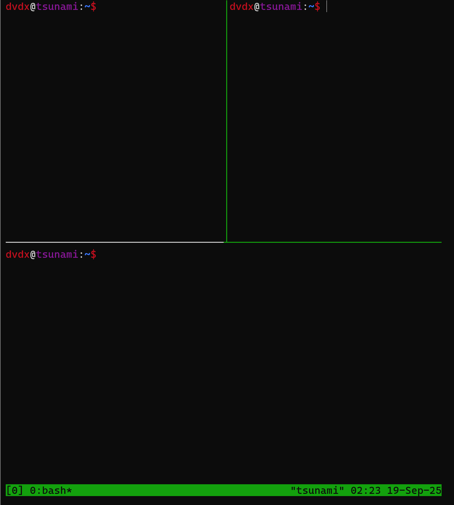

# vim

1. `d10k`
2. `Ctrl + Z` jump back to shell, type `fg` and `enter` return to vim.
3. horizonal split: `: sp new_file.txt`, vertical split`: vsp new_file.txt`, toggle between:To move between splits, use Ctrl + w followed by a directional key:
    h or Left Arrow: Move to the left split.
    j or Down Arrow: Move to the lower split.
    k or Up Arrow: Move to the upper split.
    l or Right Arrow: Move to the right split.
    w: Move to the next split in a cyclical manner.
4. normal mode : `>>` indent, `<<` unindent; visual mode: `>` indent, `<` unindent
5. Macros, which record your operation.

# tmux
6. 
10. `tmux attach -t <session_name>`
11. `tmux kill-session -t <session_name>`
12. `tmux new-session -s <session_name>`


```
#!/bin/bash

PHONEBOOK_ENTRIES="bash_phonebook_entries"


if [ "$#" -lt 1 ]; then
    exit 1

elif [ "$1" = "new" ]; then
    # YOUR CODE HERE #
    if [ "$#" -ne 3 ]; then
        exit 1
    fi
    echo "$2 $3" >> "$PHONEBOOK_ENTRIES"
elif [ "$1" = "list" ]; then
    if [ ! -e $PHONEBOOK_ENTRIES ] || [ ! -s $PHONEBOOK_ENTRIES ]; then
        echo "phonebook is empty"
    else
        # YOUR CODE HERE #
        cat "$PHONEBOOK_ENTRIES"
    fi

elif [ "$1" = "lookup" ]; then
    # YOUR CODE HERE #
    if [ "$#" -ne 2 ]; then
        exit 1
    fi
    grep "^$2" "$PHONEBOOK_ENTRIES"
elif [ "$1" = "remove" ]; then
    # YOUR CODE HERE #
    if [ "$#" -ne 2 ]; then
        exit 1
    fi
    sed -i "/^$2 /d" "$PHONEBOOK_ENTRIES"
elif [ "$1" = "clear" ]; then
    # YOUR CODE HERE #
    > "$PHONEBOOK_ENTRIES"
else
    # YOUR CODE HERE #
    echo "unknown command"
fi
```